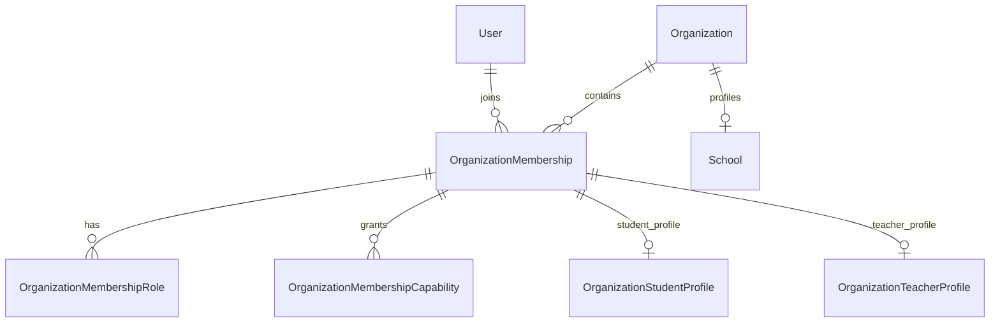
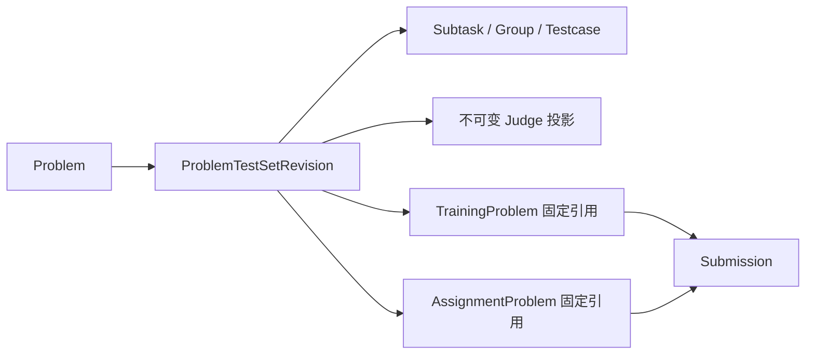
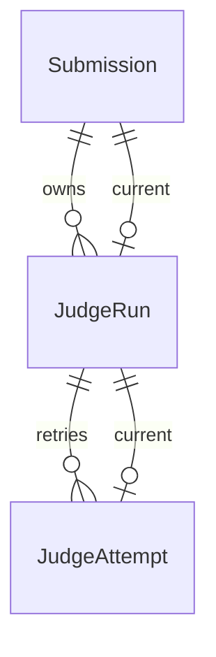

# 数据模型

当前数据库为 PostgreSQL，Prisma Schema 有 **201 个模型**。模型数由架构门禁自动统计；新增或删除模型后必须同时更新本页与[数据库参考](../reference/DATABASE_SCHEMA.md)，不得继续维护脱离 Schema 的手写旧字段目录。完整逐模型清单见[自动生成的架构清单](generated/ARCHITECTURE_INVENTORY.md)。

## 领域聚合

| 领域 | 聚合根与关键事实 |
|---|---|
| 账号与组织 | `User`、`Organization`、`School`、`OrganizationMembership`、成员资料、加入/邀请/创建申请与审计 |
| 授权 | `OrganizationMembershipRole`、`OrganizationMembershipCapability`；旧 `memberRole` 在迁移期仅作为资料身份和兼容输入 |
| 团队与教学 | `Team`、`Assignment`、`TrainingSession` 及其题目、名单、进度、提示、反馈和事件 |
| 比赛运行与 Rating | `Training(type=contest)` 是可变运行事实源；`Contest/ContestProblem` 是受边界保护的规范化投影；最终榜单和 Rating 批次不可变 |
| 题目与评测资产 | `Problem`、`ProblemTestSetRevision`、Test Graph、测试点、Blob、Judge Program、Validator/Feature/Classifier |
| Candidate 与贡献经济 | Candidate、生成任务、Wrong Corpus、Selector、Evaluation Budget、Contribution、Carits 和 Credits 账本 |
| 提交与 Judge | `Submission` 保存提交意图与远端归档结果；本地执行结果唯一来自 `JudgeRun`，物理执行来自 `JudgeAttempt` |
| 知识与题解 | Solution 投稿/审核/相似度，以及 Blog 文章、不可变版本、引用、系列、标签和社区互动 |
| 私信 | 好友、拉黑、会话、单调消息序号、持久事件、举报证据和版本化表情包 |
| 文件、AI 与运维 | 内容寻址 Blob/File、AI Token 账本、迁移和平台审计事实 |

## 身份与授权

账号的全局角色与组织成员身份分离。学生、教师和负责人是组织关系，不修改普通账号的全局 `User.role`。`OrganizationMembership.memberRole` 仍决定学生/教师资料类型；授权调用稳定 Capability。迁移阶段 Resolver 默认 `hybrid`，同时读取规范化角色/显式 Capability 与旧角色映射；完成受保护回填并对账后才允许切换 `MEMBERSHIP_CAPABILITY_SOURCE=normalized`。

## 题目、Revision 与活动

- TestSet Revision 是正式评测数据的不可变事实；YAML 只允许由结构化模型单向生成。
- 已创建活动固定 Revision，题库 Hack/Candidate 的新 Revision 不直接传播到活动。
- `Training(type=contest)` 是比赛编辑和运行状态的唯一可变事实源；`Contest/ContestProblem` 只能经 `contest-aggregate.service.ts` 同事务投影，普通领域禁止直接写。

## Submission 与 Judge

- 本地提交：`Submission` 保存代码、来源、作用域、固定 Revision、IO 意图和 `currentJudgeRunId`；状态、分数、测试点与资源指标只读取 `JudgeRun`。
- 远端归档：没有本地 Run，其来源平台结果保存在 `Submission` 的归档快照字段。
- `JudgeAttempt` 使用租约和 fencing token；终态 Attempt 不重新打开，基础设施重试创建新 Attempt，人工重测创建新 Run。
- 投影审计只比较 Run 与 Attempt，并强制本地提交均有 Run；不再要求本地 Run 回写 Submission 结果列。

#### 数据与并发约束

- 题目 Revision、训练/比赛 Assignment、聊天会话、经济账本等高竞争写入使用数据库事务锁或 advisory lock，并通过 revision/CAS 防止丢失更新。
- 正式版本、账本分录、消息、审计、举报证据和发布版本均按追加或不可变方式保存。
- 用户控制的源码、压缩包、消息、AI 请求、Candidate 和 Judge 输出均有服务端硬上限；前端禁用状态不是安全边界。
- PostgreSQL `FOR UPDATE SKIP LOCKED` 用于队列领取；测试环境不得以 SQLite 代替并发语义。
