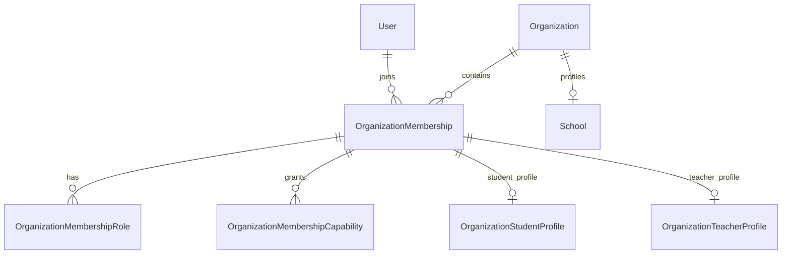
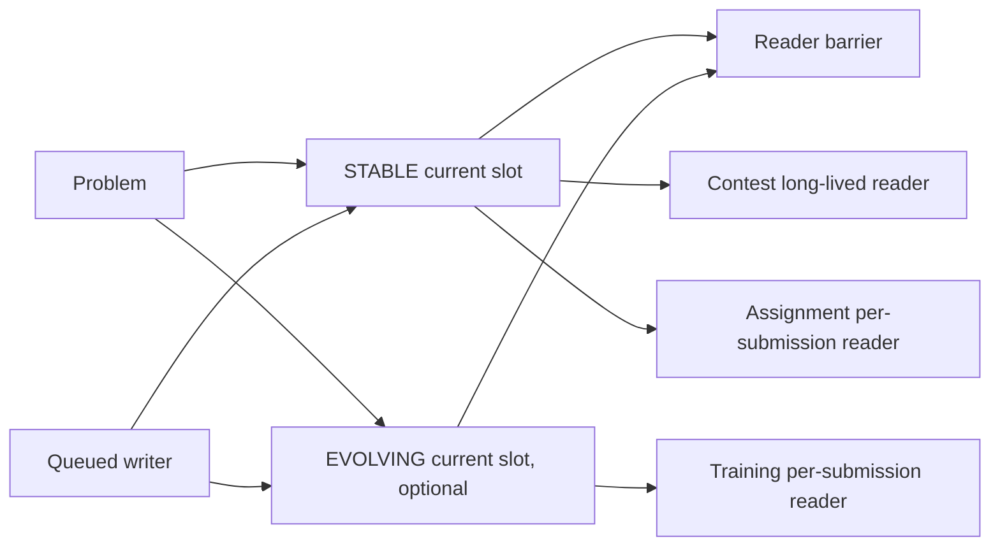
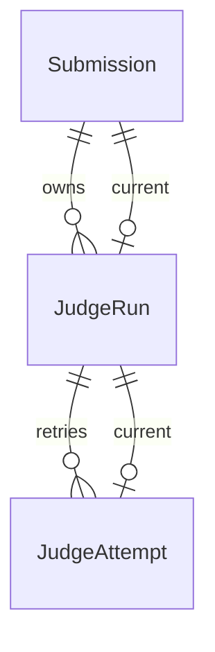

# 数据模型

当前数据库为 PostgreSQL，Prisma Schema 有 **201 个模型**。模型数由架构门禁自动统计；新增或删除模型后必须同时更新本页与[数据库参考](../reference/DATABASE_SCHEMA.md)，不得继续维护脱离 Schema 的手写旧字段目录。完整逐模型清单见[自动生成的架构清单](generated/ARCHITECTURE_INVENTORY.md)。

## 领域聚合

| 领域 | 聚合根与关键事实 |
|---|---|
| 账号与组织 | `User`、`Organization`、`School`、`OrganizationMembership`、成员资料、加入/邀请/创建申请与审计 |
| 授权 | `OrganizationMembershipRole`、`OrganizationMembershipCapability`；旧 `memberRole` 在迁移期仅作为资料身份和兼容输入 |
| 团队与教学 | `Team`、`Assignment`、`TrainingSession` 及其题目、名单、进度、提示、反馈和事件 |
| 比赛运行与 Rating | `Contest/ContestProblem` 是比赛元数据、生命周期、提交身份、Rating 身份、终结状态、发现与跨域查询的规范入口；关联的 `Training(type=contest)` 只承载参与者及 Judge 运行路由；Rating 配置、最终榜单和批次均关联规范 Contest，快照与批次不可变 |
| 题目与评测资产 | `Problem`、`ProblemTestSetSlot`、Reader/Writer 屏障、Test Graph、测试点、Blob、Judge Program、Validator/Feature/Classifier |
| Candidate 与贡献经济 | Candidate、生成任务、Wrong Corpus、Selector、Evaluation Budget、Contribution、Carits 和 Credits 账本 |
| 提交与 Judge | `Submission` 保存提交意图与远端归档结果；本地执行结果唯一来自 `JudgeRun`，物理执行来自 `JudgeAttempt` |
| 知识与题解 | Solution 投稿/审核/相似度，以及 Blog 文章、不可变版本、引用、系列、标签和社区互动 |
| 私信 | 好友、拉黑、会话、单调消息序号、持久事件、举报证据和版本化表情包 |
| 文件、AI 与运维 | 内容寻址 Blob/File、AI Token 账本、迁移和平台审计事实 |

## 身份与授权

账号的全局角色与组织成员身份分离。学生、教师和负责人是组织关系，不修改普通账号的全局 `User.role`。`User.sessionVersion` 仅负责撤销旧 JWT，不表示组织或设备身份。`OrganizationMembership.memberRole` 只决定学生/教师资料类型；授权唯一读取规范化 RoleAssignment 与显式 CapabilityGrant。所有成员写入口在同一事务同步基础 RoleAssignment，生产对账缺失与未知角色均为 0。

## 题目双槽与活动

- 每题最多只有 Stable 与 Evolving 两套当前数据；普通题只建 Stable，支持 Hack/贡献的题才建 Evolving。不存在 TestSet 历史版本和 revisionId。
- 槽关系复用内容寻址 `TestdataObject`。Writer 先关闭 gate、等待已有 Reader，再原子替换当前槽；排队写入由 fencing token 防止陈旧覆盖。
- Contest/Exam 在发布与运行期间长期持有 Stable Reader；其 Judge/Rejudge 完成后释放。Training 每次提交读取当时最新 Evolving（缺失时 Stable），Assignment 每次提交读取当时 Stable。
- Promotion 捕获当前 Evolving 到事务临时文件，验证通过后更新 Stable。临时副本不入业务模型、不形成第三版本，且不复制对象字节。
- Contest/ContestProblem 是比赛发现、跨领域查询和命令定位的唯一入口；Contest.publicId 承担数字路由。ContestProblem 保存实际 Stable 槽的 hash/fence/reader 身份。
- Submission 只保存提交意图和 Contest/ContestProblem 身份；JudgeRun/JudgeAttempt 保存执行结果与实际槽快照。
## Submission 与 Judge

- 本地提交：`Submission` 保存代码、来源、作用域、实际槽/graphHash/fencingToken、IO 意图和 `currentJudgeRunId`；比赛提交必须保存 `canonicalContestId/canonicalContestProblemId`，并以 `trainingId/trainingProblemId` 固化实际 Judge 运行对象。旧 `contestId/contestProblemId` 仅供既有历史记录读取，新提交保持为空。状态、分数、测试点与资源指标只读取 `JudgeRun`。
- 远端归档：没有本地 Run，其来源平台结果保存在 `Submission` 的归档快照字段。
- `JudgeAttempt` 使用租约和 fencing token；终态 Attempt 不重新打开，基础设施重试创建新 Attempt，人工重测创建新 Run。
- 投影审计只比较 Run 与 Attempt，并强制本地提交均有 Run；不再要求本地 Run 回写 Submission 结果列。

#### 数据与并发约束

- 题目槽 Writer、训练/比赛结构、聊天会话、经济账本等高竞争写入使用数据库事务锁或 advisory lock，并通过 revision/CAS 防止丢失更新。
- `TrainingSession` 是一堂课，并以 `currentStageId` 指向全班唯一 RUNNING Stage；`TrainingSessionStage` 保存有序教学定义与全局生命周期。`TrainingSessionGroup` 是整场训练的稳定分组；数据库模型 `TrainingSessionStageGroup` 现在表示默认 StagePlan 或分组覆盖，不再是独立运行单元。Participant 通过必填 `groupId` 归属稳定 Group，ProblemPlan 通过 `stageGroupId` 归属计划。Progress 绑定稳定 StageProblem，因此换组不会删除历史成绩。
- `TrainingSessionTemplate` 只保存个人、学校或团队可复用的 Stage/分组/规则骨架。模板不会复制题目、学员和运行事实，停用模板也不会改变已经创建的 Session。
- 正式版本、账本分录、消息、审计、举报证据和发布版本均按追加或不可变方式保存。
- 用户控制的源码、压缩包、消息、AI 请求、Candidate 和 Judge 输出均有服务端硬上限；前端禁用状态不是安全边界。
- PostgreSQL `FOR UPDATE SKIP LOCKED` 用于队列领取；测试环境不得以 SQLite 代替并发语义。

## Training Engine V2 数据关系补充

V2 的核心关系为 TrainingSession → 全局 TrainingSessionStage 时间轴 → 默认 StagePlan / 可选 Group override → TrainingSessionStageProblemPlan。TrainingSessionGroup 是整场训练的稳定分组，TrainingSessionParticipant.groupId 表示当前归属；Stage 生命周期、计时和结束原因只保存在 Stage。迁移和换组不重建已有 Progress 或 Submission。

Models covered by Training Engine V2: `TrainingSessionGroup`, `TrainingSessionGroupChange`, `TrainingSessionStageGroup`（StagePlan）, `TrainingSessionStageProblemPlan`, `TrainingSessionStageRuntimeSnapshot`, and `TrainingSessionStageTimeAdjustment`.
