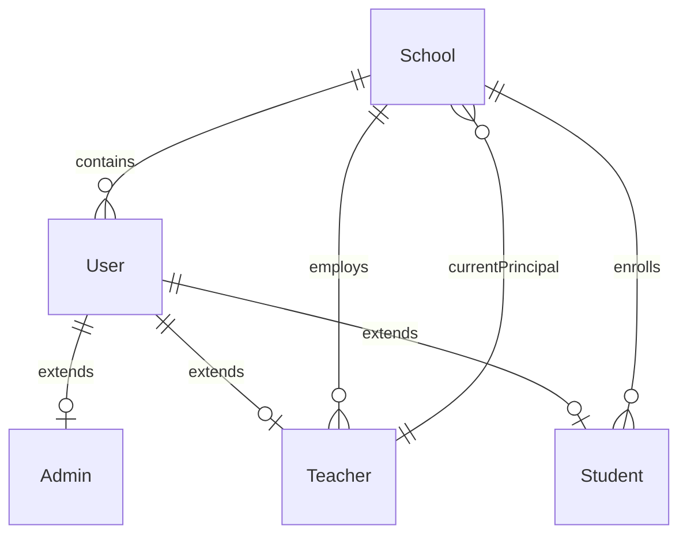
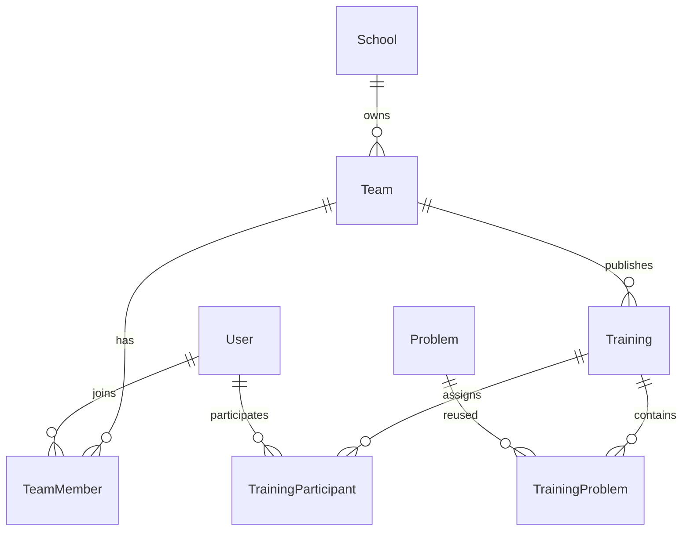

# 数据模型

当前数据库为 PostgreSQL，Prisma Schema 有 50 个模型。这里解释领域关系；逐模型
字段目录见[数据库参考](../reference/DATABASE_SCHEMA.md)。

## 领域分组

| 领域 | 模型数 | 主要模型 |
|------|-------:|----------|
| 身份与学校 | 9 | `User`, `Admin`, `Teacher`, `Student`, `School` |
| 团队与导入 | 7 | `Team`, `TeamMember`, `TeamJoinRequest`, import batch/item |
| 题目与题单 | 12 | `Problem`, `ProblemStatement`, `ProblemList`, shares |
| 训练与比赛 | 14 | `Training`, `TrainingProblem`, `Contest`, results/status |
| 提交与 OJ | 5 | `Submission`, `OjAccount`, `OjFetchJob`, bindings |
| 文件、AI、内部序列 | 3 | `File`, `AiUsageLog`, `carits_sequence` |

## 身份关系

`User.id` 同时作为 `Admin`、`Teacher` 或 `Student` 的扩展主键。用户密码字段是
`passwordHash`。学校负责人字段是 `currentPrincipalTeacherId`，不存在独立
`SchoolPrincipal` 模型。

## 团队与任务

团队所有者、管理员、教师成员和学生成员通过 `TeamMember.role` 表达。邀请、申请和
外部平台导入有独立记录，避免把临时状态塞进成员表。

## 题目、题单与提交

- `Problem` 保存统一题目和 Judge 配置，`ProblemStatement`、附件和测试数据独立。
- `ProblemList` 通过 section/entry 组织题目，通过 share、学校和团队关联控制可见性。
- `Submission` 关联用户、题目和可选训练/比赛 scope，同时保存本地或外部 OJ 状态。
- `TrainingUserProblemStatus` 与 `ContestUserProblemStatus` 保存用户级完成状态，
  不以临时内存排名作为事实来源。

## 约束

- 所有正式用户必须关联学校，包括平台管理员所在的平台学校。
- 学校必须有当前负责人，负责人转移使用事务和日志记录。
- 团队成员、题单分享和多种状态表有唯一约束，业务代码仍需处理并发冲突。
- Judge 任务领取依赖 PostgreSQL `FOR UPDATE SKIP LOCKED`，测试不得改用 SQLite。

