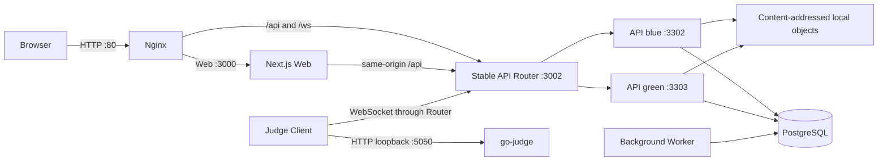

# 系统架构

## 产品与领域边界

OI Manager 是面向 OI 教学与竞赛训练的一体化管理与评测平台，保持“模块化单体 Server + 独立 Judge Runtime”：

```text
Education Domain                 Judge Domain
Organization / Team             Problem / TestSet Revision
Student / Teacher               Submission / JudgeRun / JudgeAttempt
Training / Contest              ACM/OI / Checker / Hack / Rejudge
ProblemList / Growth            Judge scheduling / result projection
```

不引入微服务、Kafka、全量 Event Sourcing 或独立消息中间件。领域复杂度通过模块、不可变版本、状态机、数据库事务、CAS 和租约收口。

## 生产运行拓扑



- Nginx、Web、Router、两个 API slot、Worker 与 Judge 由 systemd 管理。
- PostgreSQL 与 go-judge 由 Docker 管理并使用 `unless-stopped`。
- Router 固定监听回环地址 `3002`，一条既有 HTTP/WebSocket 连接固定到同一上游 slot。
- API 提升先启动候选 slot、执行 readiness，再原子切换 Router；旧 API drain 后以 WebSocket 1012 让 Judge 重连。
- 当前公网仍为 HTTP；TLS、Secure Cookie、HSTS 和严格 CSP 尚需域名与证书。

## Server 模块契约

`apps/server/src/modules/<domain>` 是业务规则的唯一落点。`routes/` 仅作为迁移期 HTTP adapter：

- 允许：解析请求、DTO 校验、认证上下文、调用 application service、映射响应。
- 禁止新增：Prisma 写入、事务、文件操作、Judge 调度、业务状态转换和资源权限决策。

现有历史路由采用 Strangler 方式逐个迁入模块，不进行一次性重写。

## Submission 与 Judge 生命周期

```text
Submission (用户提交意图，基本不可变)
  ├─ JudgeRun #1 NORMAL
  │    └─ JudgeAttempt #1
  └─ JudgeRun #2 REJUDGE
       ├─ JudgeAttempt #1 INFRA_ERROR
       └─ JudgeAttempt #2 ...
```

- `Submission` 保存用户、代码、语言、题目和活动上下文。
- `JudgeRun` 固定一次逻辑评测使用的 TestSet Revision/配置哈希和最终结果。
- `JudgeAttempt` 保存一次物理执行的 owner、fencing token、租约、分段时间与终态。
- 分段时间明确为 Queue、Dispatch、Compile、Run、Persist、Total，并由 `judge:slo` 按最近窗口检查 P95、基础设施错误率和卡住任务。
- 重测创建新的 Run；基础设施重试创建新的 Attempt，不重开终态 Attempt。
- 当前处于安全双写与观察阶段：新本地提交、领取、回传、基础设施重试和重测以 Run/Attempt 为事实源，并在同一事务维护旧 `Submission.result/judgeId/...` 兼容投影。用户可见的提交列表、详情、结果筛选、题目状态、个人概览、排名、统计和重测预览已经统一从 `Submission.currentJudgeRunId` 指向的 Run 读取；远程归档及无 Run 的历史记录才回退兼容列。兼容投影仍保留用于对账，稳定观察一个发布周期后才进入 Cleanup。

详细状态和迁移阶段见 [Judge 领域模型](./JUDGE_DOMAIN.md)。

## 测试数据、Hack 与存储

- `ProblemTestSetRevision` 是不可变评测数据版本，活动固定 Revision，题库 Practice 使用最新版。
- TestSet Revision 引用内容寻址 `TestdataObject`；Revision 目录只保存确定性 manifest/链接。
- 有效 Hack 通过 Validator/Classifier/STD/双评测后先形成不可变 `TestcaseCandidate`，再由统一晋升事务创建下一 Revision；重复、陈旧或失败候选均保留可审计终态，且不传播到既有活动。
- BlobStore application port 将本地内容寻址实现与未来 OSS/S3/MinIO 隔离；外部存储上线前本地实现仍是事实源。

## 后台任务边界

- Scheduler/Coordinator 负责必须全局唯一的 Cron 与账号验证，并持有 PostgreSQL advisory leader lock；生产兼容 unit 名为 `oi-manager-worker.service`。
- 可并行 `oi-manager-executor@N` 使用逐任务 session advisory lease；JudgeRun 队列继续使用行锁、`SKIP LOCKED`、lease 和 fencing token。
- HTTP adapter 边界由静态门禁约束：现有 legacy 债务记录为只减不增基线，新 adapter 不得直接访问 Prisma、事务、文件系统或 Judge Runtime。
- 当前后台进程仍包含迁移期单例任务；拆分过程保持同一 Worker systemd 单元，完成后才允许增加 Executor 实例。

## 失败与一致性边界

- PostgreSQL 不可用：不得回退其他数据库；结果持久化保留 owner 并有界重试。
- Judge/go-judge 断线：基础设施错误不得映射为用户 CE/RE；Attempt 失效后创建重试 Attempt。
- 旧或重复 Judge 回传：只能终结匹配 fencing token/owner 的 Attempt，不能覆盖当前 Run。
- API 蓝绿并存：数据库 advisory lock、CAS、唯一约束和状态机共同保证单次 finalization。
- 文件与数据库：先写隔离 pending/object，数据库事务发布 manifest，失败清理孤儿；定期 GC 只删除无引用对象。
