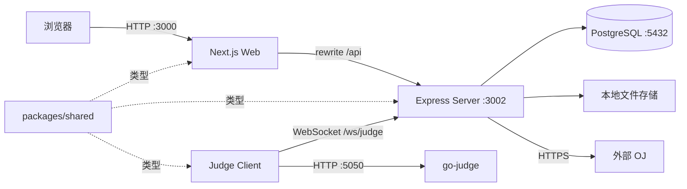

# 系统架构

## 运行拓扑

Docker Compose 只管理 PostgreSQL 和 go-judge。Web、Server、Judge 客户端由 pnpm
工作区或 PM2 启动，不在 Compose 中。

## 应用边界

### 前端

- Next.js App Router，开发端口 `3000`。
- 页面按角色目录组织，角色布局统一处理未登录和错误角色跳转。
- 浏览器默认请求相对 `/api/*`，由 Next.js 转发到 Server。
- API 客户端区分 JSON、文本和空响应，并保留真实 HTTP 状态。

### 服务端

- Express，默认端口 `3002`。
- `routes/` 保存横向或较早的路由，`modules/` 保存按领域拆分的业务模块。
- Prisma 连接 PostgreSQL；生产、开发、单元测试、E2E 使用不同 schema 或数据库。
- 同一 HTTP Server 承载 `/ws/judge` WebSocket。

### 评测机

- 独立进程，通过 `JUDGE_TOKEN` 与 Server 建立 WebSocket 会话。
- 从 Server 接收已原子领取的任务，调用 go-judge 编译和运行。
- 不直接为浏览器提供接口，也不直接决定业务权限。

### 共享模块

- `packages/shared/src/index.ts` 是 JWT、登录响应和公共 DTO 的类型来源。
- 根构建必须先构建 Shared，禁止在各应用复制同名类型。

## 主要数据流

| 流程 | 数据流 |
|------|--------|
| 登录 | Browser → Web → `/api/auth/login` → PostgreSQL → JWT |
| 页面数据 | Browser → `/api/*` → 认证/角色/资源检查 → Prisma |
| 外部抓题 | 管理页面 → OJ Fetcher → 外部 OJ → Problem/File |
| 本地提交 | Web → Submission `queuing` → Judge → go-judge → Submission 结果 |
| 外部提交 | Web/同步任务 → OJ 账号或绑定 → 外部 OJ → 轮询/同步结果 |
| 文件上传 | multipart → 临时目录 → 类型/大小检查 → File 和业务对象 |

## 后台任务

Server 启动后会运行提交轮询、文件清理等后台逻辑。E2E 使用
`DISABLE_BACKGROUND_JOBS=true`，避免定时任务和真实外部请求干扰确定性测试。

## 失败边界

- Web 无法连接 Server：显示真实 HTTP/网络错误和重试，不应伪装为空列表。
- PostgreSQL 不可用：Server 健康检查或业务请求失败，不能回退到 SQLite。
- Judge 断线：正在评测的任务恢复为 `queuing`，客户端 5 秒后重连。
- 外部 OJ 失败：返回平台错误码或保存任务失败状态，不影响本地 Judge。
- 维护 API 关闭：返回 `404`，避免暴露维护能力的存在。
