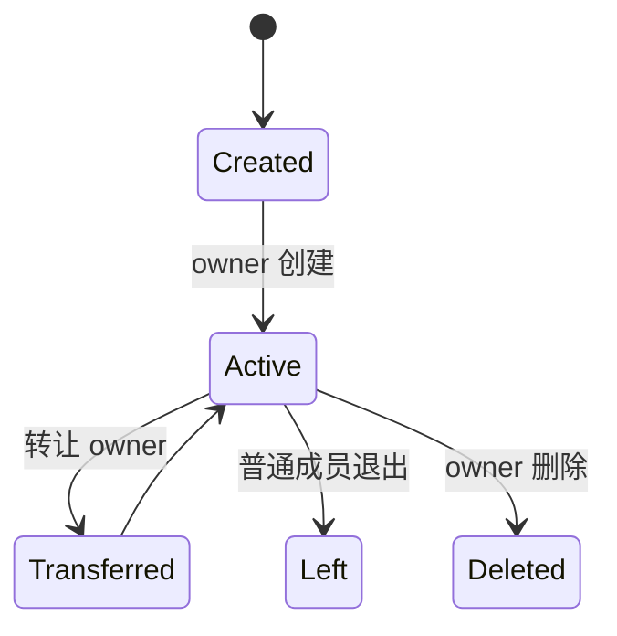

# 团队模块

## 角色

| 团队角色 | 能力 |
|----------|------|
| owner | 编辑团队、转让、删除、管理管理员和全部成员 |
| admin | 管理允许范围内的成员、邀请、申请和内容 |
| member | 查看参与内容；具体能力由团队角色和资源规则决定 |

系统角色与团队角色是两层权限。教师身份不会自动拥有所有团队，平台管理员也不会自动
成为团队管理员。

## 生命周期

团队通过 `Team.scope` 分为 `campus` 和 `personal`。校园团队按学校隔离；个人团队是
平台范围的数据空间，不进入学校团队列表，也不向客户端暴露学校归属。个人模式成员、
所有者、邀请和申请只显示平台用户名，校园模式保留实名。

任意数据库角色进入个人工作区后都以通用 `user` 成员身份创建、加入和管理个人团队，
不会继承岗位管理能力或更高配额。校园模式学生只能浏览、申请或接受校园团队邀请。
所有列表、详情和写操作都由服务端从 JWT 的 `workspaceMode` 推导作用域，客户端参数不能
跨作用域读取或修改团队。创建者成为 owner，转让成功后原 owner 降级，任何时刻只允许
一个有效 owner。

个人团队的 `schoolId` 必须为 `null`，成员和加入申请关联 `User`；校园团队必须有学校，
成员类型仍为 `teacher | student`。跨作用域详情返回 `404` 或既有兼容端点的 `403`，不得
通过平台管理员或超级管理员岗位绕过个人团队成员规则。

## 成员进入

- 邀请：管理员创建邀请，目标用户接受或拒绝。
- 申请：用户发起 join request，团队管理员批准或拒绝。
- 直接添加：具备管理权限的用户选择可用成员。
- 外部导入：VJudge、洛谷或通用平台导入先预览和解决冲突，再确认写入。

重复邀请、重复申请和重复成员由唯一约束及幂等业务逻辑处理。并发确认必须返回明确
冲突，不创建重复成员。

## 导入

导入批次保存来源、目标团队、发起者和 item 状态。成员按用户名、姓名、学校和外部账号
匹配，冲突必须在预览页显式解决。确认阶段在服务端重新校验团队权限和匹配结果，不能
信任浏览器提交的“已解决”状态。

## 资源关系

团队可关联题单并发布训练、作业和比赛。团队删除、成员退出或角色变化时，历史提交和
成绩记录保留，但后续访问按当前资源权限判断。

原始权限、状态机和并发设计保存在[历史团队文档](../../archive/legacy/team/)。

