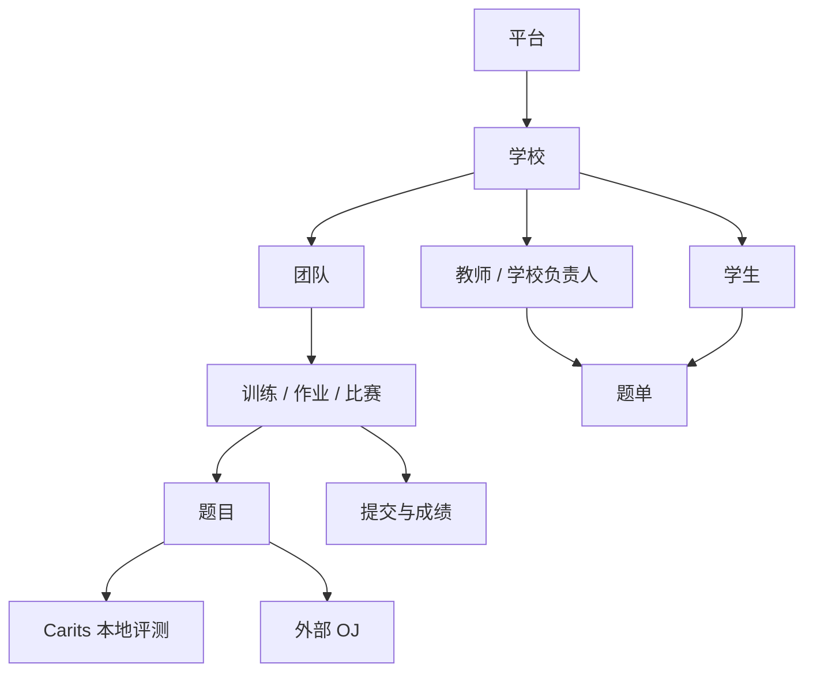

# 项目概览

OI Manager 是面向 OI 教学与竞赛训练的一体化管理与评测平台。教育管理域围绕学校、团队、
教师/学生组织题目、题单、训练、作业、比赛和排名；Judge 域负责不可变测试版本、Submission、
JudgeRun/JudgeAttempt、ACM/OI 判定、Hack 和重测。它不是只有提交页和榜单的单一 OJ，而是以
模块化单体 Server 和独立 Judge Runtime 同时承载教学管理与本地评测。

## 角色

| 角色 | 主要职责 | 前端入口 |
|------|----------|----------|
| `super_admin` | 学校、负责人、平台管理员、系统配置和维护能力 | `/admin/*` |
| `platform_admin` | 用户、题库、提交、OJ 账号和抓题任务 | `/platform-admin/*` |
| `school_principal` | 本校信息、教师管理，并继承教师业务能力 | `/org/:organizationId/*` |
| `teacher` | 学生、团队、题单、作业、比赛、成绩和排名 | `/org/:organizationId/*`、`/personal/*` |
| `student` | 校园任务；个人模式下管理个人题目、题单和团队 | `/org/:organizationId/*`、`/personal/*` |

学校负责人不是全局管理员端，而是在组织工作区获得学校管理能力。平台管理员与超级管理员
严格使用各自独立工作区，不能互相进入，也不生成个人或校园工作区。

## 业务层次

`Training.type` 区分训练、作业和比赛。团队和学校是任务发布范围，题单是可复用内容
组织，提交通过 scope 字段关联题目、训练或比赛。

## 应用组成

- `apps/web`：Next.js 前端；页面路由数量由生成清单维护。
- `apps/server`：Express API、Prisma 数据访问、外部 OJ 和 Judge WebSocket。
- `apps/judge`：独立评测客户端，连接 Server 并调用 go-judge。
- `packages/shared`：JWT、登录响应等共享类型的唯一来源。
- `e2e`：隔离的 Playwright 角色、数据、Mock 和业务流程。

进一步阅读：[系统架构](../architecture/SYSTEM_OVERVIEW.md)、
[业务模块](../architecture/modules/ORGANIZATION.md)和
[项目导览](PROJECT_TOUR.md)。
