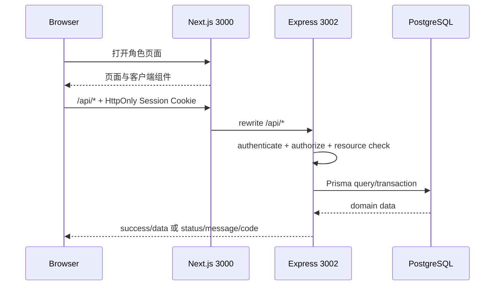
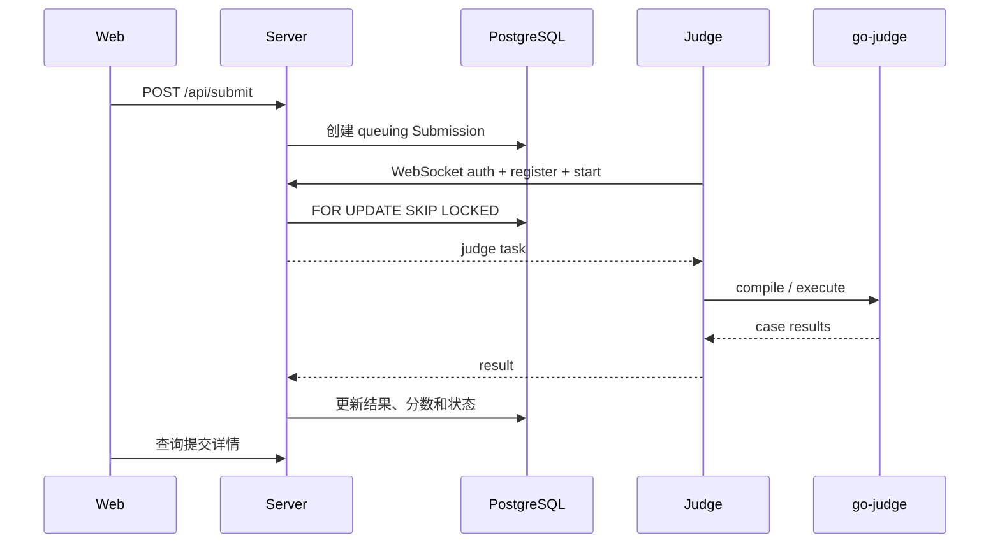

# 项目导览

## 多包仓库结构

```text
oi-manager/
├── apps/
│   ├── web/          Next.js 页面、组件、Hooks 和 API 客户端
│   ├── server/       Express 路由、业务模块、Prisma 和 WebSocket
│   └── judge/        Judge WebSocket 客户端和 go-judge 适配
├── packages/
│   └── shared/       跨应用共享类型
├── e2e/              Playwright fixture、Mock、页面清单和流程测试
├── scripts/          开发进程与文档检查脚本
├── docs/             当前文档与历史归档
└── docker-compose.yml
```

## 一次页面请求



前端通过 `AuthProvider` 管理登录状态，通过角色布局集中控制入口和首页跳转。
`sessionKey` 只用于让 SWR/组件在切换账号后重新取数，不是后端权限凭据。

## 一次本地评测



## 查找代码

| 需求 | 入口 |
|------|------|
| 页面 | `apps/web/src/app/**/page.tsx` |
| 通用业务 UI | `apps/web/src/components/` |
| 导航与角色布局 | `apps/web/src/config/navigation.ts`、`components/RoleLayout.tsx` |
| API 挂载 | `apps/server/src/index.ts` |
| 大型业务模块 | `apps/server/src/modules/` |
| 传统路由 | `apps/server/src/routes/` |
| 数据模型 | `apps/server/prisma/schema.prisma` |
| Judge 协议 | `apps/server/src/ws/judge.ts`、`apps/judge/src/client.ts` |
| UI 测试数据 | `e2e/fixtures/` |

构建必须先生成 Shared 类型，再构建 Server、Web 和 Judge。不要直接编辑
`packages/shared/src` 旁边的生成 JS/DTS 文件。
